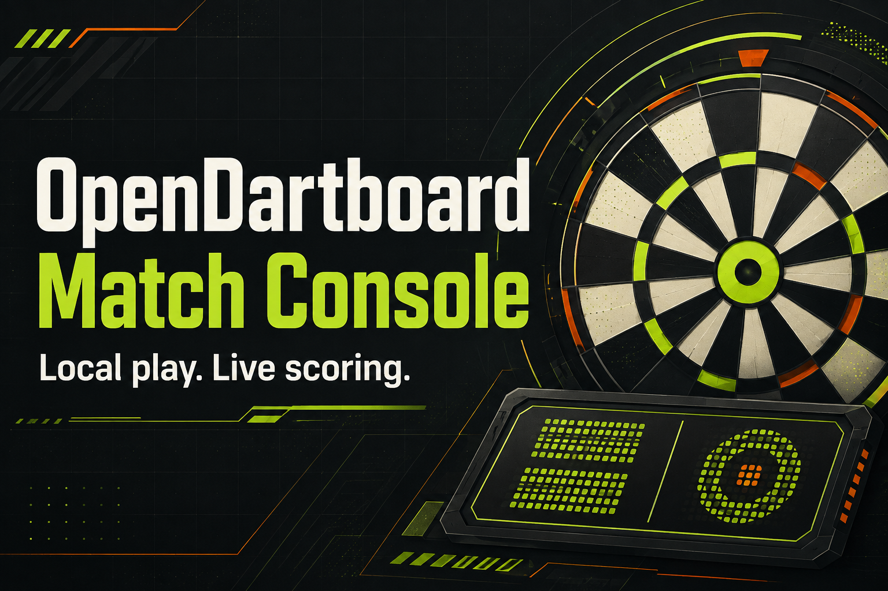

# OpenDartboard Match Console

A local-first game client and board operations console for [OpenDartboard](https://github.com/OpenDartboard/OpenDartboard). It turns the headless scorer into a complete tablet-friendly darts experience while keeping Autodarts available on the same machine.



## What it does

- Plays 301, 501, and Cricket with one to four local players
- Keeps a reusable player lineup with optional email-backed profiles shared by browsers on the same board
- Receives throws from OpenDartboard's WebSocket API
- Shows the live visit, averages, checkouts, and darts currently in the board
- Builds an in-game heat map for every player and historical maps over 7, 30, or 90 days, one year, or all time
- Supports undo and manual score correction
- Stores match history, player averages, win rates, and high visits in SQLite
- Keeps the active match authoritative on the board host so every browser resumes the same score
- Replays any persisted scoring events that arrived while the browser was disconnected
- Shows calibration health, camera scoring roles, and the latest visual overlay from every camera
- Restores an active match after refresh and exposes a Resume action after visiting Stats or Board
- Recalibrates or restarts OpenDartboard from the client
- Enables diagnostic streams and switches between local/stable scorer images
- Transfers camera ownership safely between OpenDartboard and Autodarts

## Architecture

The browser connects directly to OpenDartboard on port `13520` for live scores. On every connection it first reads the scorer's persisted event summaries, applies only events newer than the match cursor, and then drains queued live events in timestamp order. Same-origin application APIs persist the authoritative active-match snapshot, reject stale browser writes, and let other browsers converge on the same revision.

Board operations do **not** expose SSH, Docker, sudo, or host credentials to JavaScript. A root-owned service listens only on a Unix socket and accepts a fixed action enum. State-changing requests require a same-origin header, a short-lived server confirmation, and explicit acknowledgement when the board must be empty. The public web container never receives the Docker socket.

## Requirements

- A Linux OpenDartboard host with Docker and systemd
- OpenDartboard available as `opendartboard:0.1.4`
- A locally modified image tagged `opendartboard:local` if you want version switching
- Node.js 22.13 or newer to build the client
- Three cameras exposed as `/dev/video0`, `/dev/video1`, and `/dev/video2`

## Build and test

```bash
npm install
npm run build
node --experimental-strip-types --test tests/*.test.ts
python3 -m unittest tests/test_server.py tests/test_board_control.py
```

## Install on the board host

Run this from the repository root after building:

```bash
./server/install.sh
```

The installer uses the invoking user's `~/.local/share/opendartboard` directory by default. Override `OPENDARTBOARD_DATA_DIR` or `OPENDARTBOARD_STATS_DIR` when your scorer or existing history lives elsewhere.

Open `http://<board-host>:8090/`. The scoring host is detected from the page hostname and can be changed on the **Board** screen. The installer preserves the SQLite data directory and does not modify the upstream scorer image.

Missed-event recovery requires OpenDartboard diagnostic event persistence (`--debug`) and a scorer build that supports `GET /debug/events?summary=1`. The Board screen enables debug mode by default for the modified scorer release.

The control service defaults are intentionally explicit. If your image names, camera devices, or service name differ, review `server/opendartboard-control.service` and `server/board_control.py` before installation.

Player profiles are authoritative in the board's SQLite service and are available to every browser using that same Nano. Email is optional and is stored locally on that board; cross-board cloud accounts will require a separate shared identity service rather than treating an email address by itself as authentication.

## WebSocket compatibility

The client supports the current `score`, `position`, and `timestamp` fields. It also understands a backward-compatible `board_position` object:

```json
{
  "score": "T20",
  "position": { "x": 612, "y": 287 },
  "board_position": { "x": 0.0184, "y": -0.5962 }
}
```

Canonical coordinates use the bull as the origin, `+x` to the player's right, `+y` down, and the outer-double radius as `1.0`. When canonical coordinates are absent, the client places a deterministic marker inside the reported scoring bed rather than pretending a camera pixel is an accurate board coordinate.

Heat maps preserve that distinction: calibrated throws appear as exact glowing points, while older or manually entered scores shade the reported scoring bed. A single-number score shades both possible single beds, and an unlocated miss is counted as unplottable instead of being placed at an invented location. Completed-game heat maps are available from `GET /api/heatmap?playerId=<id>&period=30d`; supported periods are `7d`, `30d`, `90d`, `1y`, and `all`.

## Security notes

- Deploy this client on a trusted local network.
- Do not expose port `8090`, the OpenDartboard debug streams, or the scorer API directly to the public internet.
- The host control service is deliberately local and allowlisted, but anyone who can access the client on your LAN should be treated as a board operator.
- Never commit camera captures before reviewing them for faces, room details, network names, and other private information.

## Contributing

Bug reports and focused pull requests are welcome. For changes to the scorer itself, follow OpenDartboard's request to open an upstream issue before submitting a pull request. Keep scorer fixes, diagnostic fixtures, and client features in separate reviewable changes.

## License

MIT. OpenDartboard itself is licensed separately under GPL-3.0.
